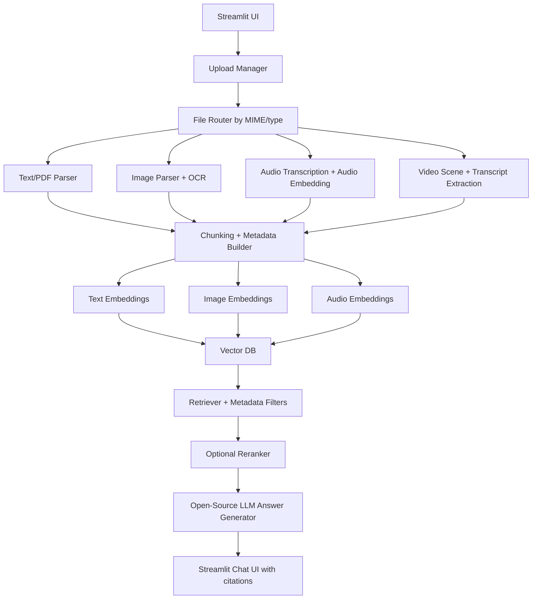

# Project Scope: Lightweight Open-Source Multimodal RAG Chat App

## 1) Vision

Build a **Streamlit-based multimodal chat application** where a user can upload documents and media from the UI, wait for ingestion and indexing to complete, see a clear **"ready to chat"** state, and then ask questions grounded in the uploaded content.

The solution should stay:

- **Open-source end to end**
- **Python-first**
- **Lightweight enough for prototyping with Streamlit**
- **Extensible from text/PDF to image/audio/video**
- **Deployable in a Streamlit-centric setup**, with clear notes on when external persistence is needed

---

## 2) Core Product Outcome

### End-to-end product flow

### Flow 1: Upload to indexed knowledge

1. User uploads one or more files from the UI.
2. Backend detects file type and routes the file to the correct parser.
3. Content is parsed, normalized, chunked, embedded, and stored in the vector database.
4. UI shows per-file progress and final indexing completion state.
5. Once indexing completes, UI shows a toast/popup style message: **Ready to chat**.

### Flow 2: User question to grounded answer

1. User asks a question in the chat interface.
2. System understands the question intent and routes retrieval to the right modality or collection.
3. App retrieves the best evidence from uploaded data.
4. Retrieved evidence is optionally reranked and assembled into answer context.
5. The answer is generated with citations such as:
   - file name
   - page number
   - image region
   - audio/video timestamp

### Supported input types

- `.txt`, `.md`, `.csv`, `.json`
- `.pdf`
- `.png`, `.jpg`, `.jpeg`, `.webp`
- `.mp3`, `.wav`, `.m4a`
- `.mp4`, `.mov`, `.mkv`

---

## 3) Product Positioning

This should not be designed as a single "upload PDFs only" chatbot. A stronger positioning is:

> **A multimodal knowledge workspace** that can ingest text, scanned documents, images, meeting recordings, and videos, and let users chat with all of them through one interface.

That makes the project more feature-rich and more reusable across use cases.

---

## 4) Recommended Architecture

## High-level architecture



## Recommended deployment shape

### Best architecture for phase 1

- **Frontend/UI:** Streamlit
- **Backend app logic:** Python modules inside the same Streamlit app
- **Vector DB:** Qdrant local mode on disk for development; external/persistent Qdrant for production
- **File/object storage:** local during development, object storage for production
- **LLM inference:** open-source model served separately when needed

### Why not force everything into one single Streamlit container?

For small text demos, it works. For **PDF + OCR + image + audio + video + local LLM**, a single Streamlit deployment becomes heavy fast. The practical production pattern is:

- Streamlit for UI and orchestration
- Python workers/modules for ingestion
- a persistent vector store
- a separately served open-source LLM endpoint if chat generation becomes too heavy

This still remains fully open-source.

---

## 5) Document Format: Flow 1 and Flow 2

This document is organized in two major execution flows:

### Flow 1: Ingestion pipeline

Flow 1 covers everything from:

**upload -> file identification -> parsing -> metadata extraction -> chunking -> embedding -> vector storage**

### Flow 2: Retrieval and chat pipeline

Flow 2 covers everything from:

**user query -> query understanding -> retrieval -> reranking -> context assembly -> answer generation -> citations -> chat UX**

### How to read the document

- Sections labeled **Shared Foundation** apply to both flows.
- Sections labeled **Flow 1** focus on ingestion and indexing.
- Sections labeled **Flow 2** focus on search, answer generation, and chat experience.

---

## 6) Shared Foundation: Recommended Open-Source Stack

| Layer | Recommendation | Why it fits | Lightweight note |
|---|---|---|---|
| UI | Streamlit | Fastest route to upload + chat UX | Excellent for prototype and internal apps |
| Chat UI | `st.chat_input`, `st.chat_message` | Native chat widgets | No custom frontend needed |
| Upload | `st.file_uploader` | Native multi-file upload | Simple |
| Status UX | `st.status`, `st.toast`, `st.progress` | Clear indexing lifecycle | Great for "ready to chat" |
| Text embeddings | `BAAI/bge-small-en-v1.5` | Strong retrieval quality for small footprint | Good default |
| Optional multilingual text | `BAAI/bge-m3` | Multilingual + longer context + hybrid-friendly | Heavier than `bge-small` |
| Image embeddings | OpenCLIP / CLIP ViT-B/32 | Mature, open-source image-text embedding | Reasonably light |
| Audio pipeline | Faster-Whisper + LAION CLAP | Transcript + audio-semantic retrieval | Start with transcript-only if needed |
| Video pipeline | FFmpeg + Faster-Whisper + keyframes + CLIP | Practical and lightweight | Better than heavy end-to-end video models |
| PDF extraction | PyMuPDF first, PaddleOCR fallback | Fast for born-digital PDFs, OCR for scanned docs | Best hybrid approach |
| Vector DB | Qdrant | Named vectors, filters, local mode, production path | Strong long-term choice |
| Simpler alternative | Chroma | Easy local setup; supports multimodal text/image workflows | Good for quick demos |
| Reranker | `BAAI/bge-reranker-base` | Improves retrieval precision | Optional in v1.1 |
| LLM | Qwen2.5-3B-Instruct GGUF or Phi-3.5-mini-instruct | Open-source chat generation | Better hosted separately for production |

---

## 7) Flow 1 Design: Modality-by-Modality Ingestion

## 7.1 Text files (`txt`, `md`, `csv`, `json`)

### Pipeline

1. Read file
2. Normalize encoding
3. Chunk into semantic blocks
4. Embed with `bge-small-en-v1.5`
5. Store chunks + metadata in vector DB

### Metadata to store

- `document_id`
- `file_name`
- `file_type`
- `chunk_id`
- `section_title`
- `source_path`
- `language`
- `created_at`

---

## 7.2 PDF files

### Recommended strategy

Use a **two-path parser**:

- **Path A:** PyMuPDF for born-digital PDFs
- **Path B:** PaddleOCR for scanned/image PDFs or low-text pages

### Why this is better

- PyMuPDF is fast and ideal for normal PDFs.
- OCR should be used only when necessary because it is slower and heavier.
- This gives better performance on Streamlit-sized deployments.

### PDF outputs to preserve

- page text
- page number
- bounding boxes if OCR is used
- extracted images/figures
- table text if available

### Enhancement

Store page thumbnails so the chat answer can show:

- cited page preview
- highlighted region
- download/open source page

---

## 7.3 Images

### Recommended strategy

For images, do **dual extraction**:

1. **Visual embedding** using OpenCLIP
2. **OCR text extraction** using PaddleOCR when text is present

### Why dual extraction matters

Some user questions are visual:

- "show images with a dashboard"
- "find photos containing a helmet"

Some are textual:

- "what is written on the invoice image?"
- "find the serial number from screenshots"

Using only OCR or only CLIP leaves recall gaps.

### Optional v1.1 enhancement

Add image caption generation with a lightweight BLIP-family caption model for richer retrieval.

---

## 7.4 Audio

### Recommended strategy

Start with **transcription-first retrieval**, then add audio-semantic retrieval if needed.

#### Phase 1

- Transcribe with Faster-Whisper
- Chunk transcript by time windows
- Embed transcript chunks with text embeddings
- Store timestamps for playback-linked citations

#### Phase 1.1

- Also compute audio embeddings with LAION CLAP
- Use them for non-speech sounds and richer semantic matching

### Why this is the right lightweight choice

Transcript retrieval is cheaper and often enough for meetings, lectures, interviews, and calls.
CLAP can be added later where users care about music, acoustic events, emotion, or non-speech cues.

---

## 7.5 Video

### Recommended strategy

Do **not** begin with a heavy end-to-end video-language model.

Instead:

1. Extract audio track
2. Transcribe with Faster-Whisper
3. Sample keyframes or scene cuts with FFmpeg
4. Embed keyframes with OpenCLIP
5. Embed transcript chunks with text embeddings
6. Store timestamps for both transcript and frames

### Why this is better for Streamlit deployment

- Much lighter than full VLM/video encoders
- Easier to debug
- Easier to cite with timestamps
- Lets the system answer both spoken-content and visual-scene questions

---

## 8) Flow 1 Design: Vector Database and Storage Layout

## Recommended primary choice: Qdrant

Why Qdrant is a strong fit:

- supports **payload filtering**
- supports **named vectors**
- supports **local mode** for small deployments
- has a smooth path to a real server later

### Suggested collection strategy

Use **one logical collection per tenant/project/workspace**, with payload-based filtering and modality metadata.

Important Qdrant note:

- vectors within a given vector field must share dimensionality
- different modalities often produce different vector sizes

So use either:

1. **named vectors** in one collection, or
2. **separate collections per modality**

### Recommended practical pattern

For v1, use **separate collections**:

- `text_chunks`
- `image_chunks`
- `audio_chunks`
- `video_chunks`

Then merge retrieval results in the app layer.

This is simpler than cross-modality scoring inside one collection.

## Simpler alternative: Chroma

Chroma is easier for quick demos and has documented multimodal support for text and images. It is a good fallback if you want the fastest initial build. However, for a broader txt/pdf/image/audio/video roadmap, Qdrant gives a cleaner long-term structure.

---

## 9) Flow 2 Design: Retrieval Architecture

## Recommended retrieval flow

1. Detect query intent
   - text-only
   - document question
   - image question
   - meeting/audio question
   - video question
2. Route query to relevant collections
3. Retrieve top-k per modality
4. Normalize scores
5. Merge ranked results
6. Optionally rerank top results
7. Build grounded answer context
8. Generate answer with citations

## Strong v1 design choice

Prefer **retrieval-first + evidence-rich answers** over fancy generation.

The app should answer like this:

> "According to page 4 of `policy.pdf`..."  
> "At timestamp 00:12:24 in `call.mp3`..."  
> "From image `invoice_02.png`, the OCR text shows..."

This makes the chatbot trustworthy.

---

## 10) Flow 2 Design: UX / UI Features

## v1 must-have

- multi-file upload
- file-type badges
- indexing progress per file
- global ingestion status
- ready-to-chat toast/popup
- chat history
- answer citations
- source preview panel
- error state per file
- re-upload / replace file

## v1.1 high-value enhancements

- drag-and-drop batch uploads
- workspace/collection selector
- document list with indexed status
- delete/re-index files
- thumbnail previews for images/PDF pages
- audio/video player with click-to-timestamp
- query filters by file, date, modality, tags
- answer confidence indicator
- reranker toggle
- multilingual ingestion mode

## v2 advanced features

- role-based workspaces
- background ingestion queue
- speaker diarization for meetings
- table-aware retrieval for PDFs
- chart/diagram understanding
- duplicate file detection
- semantic caching
- feedback loop: thumbs up/down on answers
- agentic workflows like summarize, compare, extract action items

---

## 11) Suggested Application Use Cases

This architecture can serve multiple applications:

1. **Enterprise knowledge assistant**
   - policies
   - SOPs
   - internal manuals
   - screenshots
   - recorded training sessions

2. **Meeting intelligence assistant**
   - upload meeting audio/video
   - ask questions by topic
   - generate summaries and action items

3. **Document review assistant**
   - contracts
   - invoices
   - forms
   - scanned records

4. **Media archive search**
   - search images, clips, and transcripts together
   - retrieve by timestamp or visual similarity

5. **Support and troubleshooting bot**
   - manuals
   - error screenshots
   - device videos
   - call center recordings

6. **Learning assistant**
   - lecture notes
   - slides
   - recordings
   - whiteboard images

---

## 12) Recommended Phase-wise Delivery

## Phase 1: MVP

Scope:

- Streamlit UI
- upload txt/pdf/image
- text/PDF/image parsing
- text embeddings + image embeddings
- Qdrant local mode or Chroma
- chat with citations
- ready-to-chat status message

Why:

- fastest usable version
- lowest deployment complexity
- enough to prove the architecture

## Phase 2: Audio

Scope:

- Faster-Whisper transcription
- transcript chunk retrieval
- timestamp citations
- audio player integration

## Phase 3: Video

Scope:

- extract transcript + keyframes
- timestamped multimodal retrieval
- frame previews

## Phase 4: Quality improvements

Scope:

- reranker
- metadata filters
- OCR fallback automation
- hybrid retrieval
- observability

---

## 13) Deployment Guidance

## Development / demo deployment

You can keep everything simple:

- Streamlit app
- local filesystem for temporary files
- Qdrant local mode on disk or Chroma persistence
- lightweight embedding models loaded in app

## Production reality check

If you deploy only on Streamlit Community Cloud, be careful with:

- model size
- OCR dependencies
- FFmpeg requirements
- audio/video processing time
- persistence of uploaded and indexed data across restarts

### Recommended production shape

- Streamlit app for UI
- persistent object storage for source files
- persistent vector DB
- optional background worker for ingestion
- optional separate open-source LLM service

This remains fully open-source while being much more reliable.

---

## 14) Suggested Internal Modules

```text
app.py
ui/
  upload.py
  chat.py
  status.py
core/
  config.py
  models.py
  state.py
ingestion/
  router.py
  text_ingestor.py
  pdf_ingestor.py
  image_ingestor.py
  audio_ingestor.py
  video_ingestor.py
  chunking.py
embeddings/
  text_embedder.py
  image_embedder.py
  audio_embedder.py
vectorstore/
  qdrant_store.py
retrieval/
  retriever.py
  reranker.py
  citations.py
llm/
  generator.py
utils/
  files.py
  ffmpeg.py
  ocr.py
```

---

## 15) Architecture Decisions I Recommend

### Decision 1: Use modality-specific pipelines, not one giant universal model

Why:

- lighter
- cheaper
- easier to deploy
- easier to debug
- better fit for Streamlit

### Decision 2: Use transcription + keyframes for video in v1

Why:

- far lighter than end-to-end video-language models
- gives strong practical performance

### Decision 3: Use OCR only as fallback when text extraction is poor

Why:

- keeps PDF ingestion fast
- avoids making every file expensive

### Decision 4: Keep ingestion and chat loosely coupled

Why:

- user can see indexing progress clearly
- failures are isolated
- later you can move ingestion to background workers without redesigning UI

### Decision 5: Prefer evidence display over opaque answers

Why:

- better trust
- easier QA
- easier demos

---

## 16) Final Recommended Stack for Your Project

If the goal is **practical, open-source, lightweight, and deployable**, this is the best balanced stack:

- **UI:** Streamlit
- **Backend:** Python
- **Text embedding:** `BAAI/bge-small-en-v1.5`
- **Image embedding:** OpenCLIP ViT-B/32
- **PDF parsing:** PyMuPDF
- **OCR fallback:** PaddleOCR
- **Audio transcription:** Faster-Whisper
- **Audio embedding (optional):** LAION CLAP
- **Video pipeline:** FFmpeg + Faster-Whisper + OpenCLIP keyframes
- **Vector DB:** Qdrant
- **Reranker (optional):** `BAAI/bge-reranker-base`
- **Open-source chat model:** Qwen2.5-3B-Instruct GGUF or Phi-3.5 mini

## Best MVP scope

Start with:

- txt
- pdf
- image
- Qdrant
- text/image retrieval
- citation-based chat

Then extend to:

- audio
- video
- reranking
- filtering

---

## 17) Official Documentation References

- Streamlit `st.file_uploader`: https://docs.streamlit.io/develop/api-reference/widgets/st.file_uploader
- Streamlit `st.status`: https://docs.streamlit.io/develop/api-reference/status/st.status
- Streamlit `st.toast`: https://docs.streamlit.io/develop/api-reference/status/st.toast
- Streamlit `st.chat_input`: https://docs.streamlit.io/develop/api-reference/chat/st.chat_input
- Streamlit `st.chat_message`: https://docs.streamlit.io/develop/api-reference/chat/st.chat_message
- Streamlit Community Cloud: https://docs.streamlit.io/deploy/streamlit-community-cloud
- Chroma introduction: https://docs.trychroma.com/docs/overview/introduction
- Chroma getting started: https://docs.trychroma.com/docs/overview/getting-started
- Chroma multimodal embeddings: https://docs.trychroma.com/docs/embeddings/multimodal
- Qdrant quickstart: https://qdrant.tech/documentation/quickstart/
- Qdrant collections: https://qdrant.tech/documentation/manage-data/collections/
- Qdrant local mode via LangChain integration docs: https://qdrant.tech/documentation/frameworks/langchain/#local-mode
- Sentence Transformers docs: https://www.sbert.net/
- OpenAI CLIP repository: https://github.com/openai/CLIP
- Whisper repository: https://github.com/openai/whisper
- PaddleOCR repository: https://github.com/PaddlePaddle/PaddleOCR

---

## 18) Research Paper References

- Radford et al., **Learning Transferable Visual Models From Natural Language Supervision (CLIP)**, 2021: https://arxiv.org/abs/2103.00020
- Radford et al., **Robust Speech Recognition via Large-Scale Weak Supervision (Whisper)**, 2022: https://arxiv.org/abs/2212.04356
- Wu et al., **Large-scale Contrastive Language-Audio Pretraining with Feature Fusion and Keyword-to-Caption Augmentation (CLAP)**, 2022: https://arxiv.org/abs/2211.06687
- Liu et al., **Visual Instruction Tuning (LLaVA)**, 2023: https://arxiv.org/abs/2304.08485
- Lewis et al., **Retrieval-Augmented Generation for Knowledge-Intensive NLP Tasks**, 2020: https://arxiv.org/abs/2005.11401
- Reimers and Gurevych, **Sentence-BERT: Sentence Embeddings using Siamese BERT-Networks**, 2019: https://arxiv.org/abs/1908.10084

---

## 19) Recommended Next Step

If you want, the next iteration of this scope can be expanded into:

1. a **detailed folder structure**
2. an **implementation plan**
3. a **low-level architecture diagram**
4. a **Streamlit MVP backlog**
5. a **requirements.txt / dependency shortlist**
6. a **phased build plan for txt/pdf/image/audio/video**

---

## 20) Flow 1: Ingestion Challenges from Upload to Vector DB

This section focuses on the operational challenges in the end-to-end ingestion flow:

**Upload -> File identification -> Parsing -> Metadata extraction -> Chunking -> Embedding -> Vector DB storage**

## 20.1 Upload-stage challenges

### Challenge: misleading file extensions

A file may be named `.pdf` or `.txt` but contain unexpected content or be corrupted.

**Mitigation**

- detect MIME type, not just extension
- validate file signature where possible
- attempt lightweight parser open before full ingestion
- mark file as `uploaded`, `validated`, `failed`, or `indexed`

### Challenge: very large files

Large PDFs, long videos, and hour-long audio can block the UI and cause timeouts.

**Mitigation**

- save upload first
- process asynchronously or in staged steps
- show per-file progress in Streamlit
- enforce file size and duration limits for MVP

### Challenge: duplicate uploads

Users may upload the same file multiple times with a different name.

**Mitigation**

- compute file hash
- store hash in metadata
- warn on duplicates
- support re-index vs skip

---

## 20.2 File identification and routing challenges

### Challenge: one file contains multiple content types

This is common with PDFs:

- selectable text
- scanned pages
- embedded images
- tables
- forms
- mixed-language pages

### How to identify mixed-content PDFs

For each page, extract signals such as:

- amount of selectable text
- number of embedded images
- OCR text confidence
- text coverage area on page
- presence of vector drawing objects

### Practical page classification logic

For every page:

1. Try direct text extraction with PyMuPDF.
2. Measure extracted text length and density.
3. Count images on the page.
4. If text is empty or too sparse, run OCR on page image.
5. Compare OCR output confidence and text length.
6. Label the page as one of:
   - `digital_text_page`
   - `scanned_page`
   - `mixed_text_image_page`
   - `image_only_page`
   - `table_heavy_page`

### Example rule of thumb

- if direct text length is high -> use direct extraction as primary
- if direct text length is low and image count is high -> OCR the page
- if both direct text and OCR yield useful output -> treat as mixed-content page

This page-level classification is better than making a single decision for the entire PDF.

### Challenge: wrong parser chosen too early

If the whole PDF is classified as text-only, you may miss scanned annexures or screenshots inside it.

**Mitigation**

- classify **per page**, not only per file
- allow hybrid parsing output for one document
- store the parsing method used in metadata

---

## 20.3 Parsing-stage challenges

### Challenge: reading order is broken

In PDFs, extracted text may come out in the wrong order:

- headers mixed with body text
- multi-column layout merged incorrectly
- footers injected into paragraphs

**Mitigation**

- preserve page coordinates when possible
- use block-level extraction instead of plain text dump
- remove repeating headers/footers during cleaning
- keep page number and bounding box metadata

### Challenge: scanned pages with poor OCR

OCR quality drops for:

- low-resolution scans
- skewed pages
- handwritten notes
- stamps/signatures
- tables and forms

**Mitigation**

- preprocess images: deskew, denoise, sharpen if needed
- store OCR confidence
- route low-confidence pages for fallback logic
- keep original page image for future reprocessing

### Challenge: tables are flattened into bad text

Plain OCR or text extraction often destroys table structure.

**Mitigation**

- detect table-heavy pages
- extract table blocks separately
- store both:
  - normalized text representation
  - structured cell/row metadata if available

### Challenge: image understanding is weak if only OCR is used

An image may contain:

- diagrams
- charts
- screenshots
- photos

OCR alone will miss non-text semantics.

**Mitigation**

- run OCR for text-bearing images
- run image embeddings for visual semantics
- optionally add captions later

---

## 20.4 Metadata extraction challenges

### Challenge: incomplete metadata

If metadata is weak, retrieval quality and filtering both degrade.

### Metadata you should capture at minimum

- `document_id`
- `source_file_name`
- `source_type`
- `mime_type`
- `file_hash`
- `page_number`
- `chunk_id`
- `modality`
- `parser_used`
- `language`
- `created_at`
- `ocr_used`
- `ocr_confidence`
- `start_time` / `end_time` for audio-video
- `bbox` for page/image regions

### Challenge: metadata extracted at file level but needed at chunk level

For retrieval, metadata often must exist per chunk, not just per file.

Example:

- document-level metadata says `policy.pdf`
- user asks about page 17
- retrieval must return chunk-level page metadata, not only document metadata

**Mitigation**

- propagate document metadata to chunk metadata
- enrich each chunk with page or time references

### Challenge: inconsistent IDs

If `document_id`, `chunk_id`, and vector IDs are inconsistent, delete/update operations become difficult.

**Mitigation**

Adopt a stable ID pattern like:

- `document_id`
- `page_id`
- `chunk_id`
- `embedding_id`

For example:

`doc_001:p_004:c_002`

---

## 20.5 Chunking challenges

### Challenge: chunking too early

If you chunk before understanding layout, you may split:

- a table across chunks
- a figure from its caption
- a question from its answer

**Mitigation**

- parse into logical blocks first
- then chunk by semantic unit
- only then apply token/character limits

### Challenge: chunking by fixed size only

Naive chunking creates broken context and poor retrieval.

**Mitigation**

Use hierarchical chunking:

1. document
2. page or timestamp segment
3. block/section
4. final retrieval chunk

### Challenge: mixing modalities inside one chunk

A page might include text + image + caption + table.

**Mitigation**

- create linked chunks rather than forcing one giant chunk
- keep relationship metadata such as:
  - `parent_document_id`
  - `parent_page`
  - `related_image_id`
  - `caption_chunk_id`

### Challenge: chunk overlap is too low or too high

- too low -> context breaks
- too high -> storage cost rises and retrieval becomes noisy

**Mitigation**

- start with moderate overlap
- tune using actual retrieval failures
- vary strategy by modality

---

## 20.6 Embedding challenges

### Challenge: one embedding model does not fit all modalities

Text, images, audio, and video-derived data usually should not all use the same model.

**Mitigation**

- text -> text embedding model
- image -> image-text embedding model
- audio transcript -> text embedding model
- raw audio semantics -> audio-text embedding model
- video -> transcript embeddings + frame embeddings

### Challenge: incompatible embedding dimensions

Different models produce different vector sizes.

This affects collection design in the vector DB.

**Mitigation**

- separate collections by modality, or
- use named vectors with explicit schema

### Challenge: embedding bad chunks

If the parsed text is noisy, OCR-garbled, or duplicated, embeddings become low quality.

**Mitigation**

- clean text before embedding
- drop boilerplate and repeated headers
- skip empty/near-empty chunks
- flag low-confidence OCR chunks

### Challenge: multilingual or code-switched content

A single file may contain English plus another language.

**Mitigation**

- detect language per page or chunk
- use multilingual embeddings when necessary
- store detected language in metadata

---

## 20.7 Vector DB storage challenges

### Challenge: bad schema design

If vectors are stored without useful payload fields, retrieval will be hard to filter and explain.

**Mitigation**

Every vector record should include:

- vector ID
- chunk text or URI reference
- modality
- document ID
- page/timestamp reference
- parser info
- confidence signals
- tags or workspace ID

### Challenge: updates and re-indexing

If a user uploads a revised document, old vectors may remain and create conflicting answers.

**Mitigation**

- version documents
- soft-delete or hard-delete prior vectors by `document_id`
- keep ingestion status transactional at document level

### Challenge: partial ingestion failures

Example:

- file uploaded successfully
- first 40 pages parsed
- OCR crashes on page 41

**Mitigation**

- track status per file and optionally per page
- mark documents as:
  - `uploaded`
  - `parsing`
  - `parsed_partial`
  - `embedding`
  - `indexed`
  - `failed`
- never show "ready to chat" until required indexing steps are complete

### Challenge: storing only vectors without source linkage

If you do not preserve source pointers, the chat UI cannot cite evidence correctly.

**Mitigation**

- keep file path or object storage URI
- keep page number or time span
- keep preview reference if available

---

## 20.8 Retrieval-quality risks caused by ingestion mistakes

Even if chat generation is good, retrieval will fail when ingestion is weak.

Common root causes:

- wrong parser chosen
- OCR not triggered when needed
- bad reading order
- poor chunk boundaries
- missing metadata
- duplicate chunks
- mixed modalities stored without routing logic

This is why **ingestion quality is the real foundation** of the chatbot.

---

## 20.9 Recommended design rules for Flow 1

1. **Classify per page/segment, not only per file.**
2. **Preserve metadata at chunk level.**
3. **Keep parser decisions transparent in metadata.**
4. **Separate modality pipelines, but link related chunks.**
5. **Do not show chat-ready state until indexing is complete.**
6. **Design IDs and re-index logic from day one.**
7. **Store confidence and provenance, not just text and vectors.**

## 20.10 Example of a robust mixed-PDF handling flow

For a PDF containing selectable text, screenshots, and scanned annexures:

1. Upload file.
2. Compute file hash and basic metadata.
3. Iterate page by page.
4. Run direct text extraction.
5. Measure extracted text density.
6. Detect embedded images.
7. If text is insufficient, render page and run OCR.
8. Label page type.
9. Create page-level blocks:
   - paragraph blocks
   - table blocks
   - image blocks
10. Generate:
   - text chunks for retrieved text
   - OCR chunks for scanned content
   - image embeddings for visual blocks
11. Link all chunks back to the same document/page.
12. Store in modality-aware collections.
13. Mark document `indexed` only after all required writes succeed.

That pattern is the safest foundation for your Flow 1 pipeline.

---

## 21) Flow 2: Retrieval and Chat Challenges from User Query to Final Answer

This section focuses on the operational challenges in the second half of the system:

**User query -> query understanding -> retrieval routing -> reranking -> context assembly -> answer generation -> citations -> chat response**

## 21.1 Query-input challenges

### Challenge: vague or underspecified questions

Users often ask:

- "summarize this"
- "what does it say?"
- "what happened here?"

Without enough context, the system may retrieve weak evidence.

**Mitigation**

- use recent chat history
- ask clarifying follow-up questions when needed
- show which file/workspace is currently active
- support filters like document, modality, date, or tag

### Challenge: follow-up questions depend on prior turns

Example:

- Turn 1: "summarize the contract"
- Turn 2: "what about the payment clause?"

Turn 2 cannot be answered correctly without conversation state.

**Mitigation**

- maintain short conversational memory
- rewrite follow-up questions into standalone retrieval queries
- keep the rewritten query internal and preserve the original for display

### Challenge: multilingual or mixed-language questions

The user may ask in one language while the source content is in another.

**Mitigation**

- detect query language
- use multilingual embeddings where needed
- preserve source-language citations
- optionally translate answer text while keeping original evidence

---

## 21.2 Query understanding and routing challenges

### Challenge: routing the question to the wrong modality

Examples:

- a visual question routed only to text chunks
- an audio question routed only to transcript text
- a timestamp question routed to image embeddings

**Mitigation**

Classify the query into one or more intents such as:

- document QA
- OCR lookup
- image understanding
- meeting/audio lookup
- video scene lookup
- cross-document comparison

Then query the appropriate collections.

### Challenge: one question needs multiple modalities

Example:

> "In the meeting recording, what was said when the dashboard error screenshot appeared?"

This needs:

- transcript retrieval
- frame retrieval
- timestamp alignment

**Mitigation**

- support multi-collection retrieval for one query
- merge evidence across modalities
- link related chunks by document/time/page metadata

---

## 21.3 Retrieval-stage challenges

### Challenge: top-k retrieval returns irrelevant chunks

Even a good embedding model can return:

- semantically similar but wrong chunks
- duplicated chunks
- chunks from wrong files

**Mitigation**

- apply metadata filters
- tune chunking and overlap
- deduplicate near-identical chunks
- use reranking for the final shortlist

### Challenge: score comparison across modalities is unstable

Similarity scores from text, image, and audio models are not directly comparable.

**Mitigation**

- retrieve top-k per modality separately
- normalize or calibrate scores before merge
- allow modality-specific thresholds
- rerank after merging

### Challenge: retrieval misses the right chunk because metadata was weak

This is often a Flow 1 problem showing up in Flow 2.

**Mitigation**

- preserve chunk-level provenance
- store parser type, page number, timestamps, and confidence
- inspect failed queries and feed improvements back into ingestion

---

## 21.4 Reranking challenges

### Challenge: reranker improves precision but hurts latency

Reranking adds quality, but it also adds compute cost.

**Mitigation**

- rerank only a small shortlist
- use reranking on hard queries or as an optional toggle
- monitor latency and answer quality tradeoffs

### Challenge: reranker overweights text-rich chunks

Image or audio-derived evidence may be deprioritized if reranking is text-centric.

**Mitigation**

- rerank within modality first, then across modalities
- convert non-text evidence into text descriptors where useful
- retain raw provenance even when reranked

---

## 21.5 Context assembly challenges

### Challenge: too much context is sent to the model

If too many chunks are assembled:

- token usage rises
- latency rises
- answer quality may actually drop

**Mitigation**

- compress evidence before generation
- cap the number of chunks
- prefer diversity over near-duplicate chunks
- assemble context by evidence type: text, OCR, image notes, transcript

### Challenge: conflicting evidence from multiple files

Two uploaded documents may disagree.

**Mitigation**

- preserve source attribution for every evidence block
- instruct the model to report conflicts explicitly
- surface multiple cited sources in the final answer

### Challenge: tables, captions, and timestamps lose their linkage

Even when retrieval is correct, the answer can be misleading if the supporting context is detached from its page region or time span.

**Mitigation**

- bundle evidence with structural metadata
- keep captions attached to figures where possible
- keep transcript text attached to time ranges

---

## 21.6 Answer-generation challenges

### Challenge: hallucinated answers

The model may produce a fluent answer not fully supported by evidence.

**Mitigation**

- instruct the model to answer only from retrieved evidence
- require citations in answer format
- use "insufficient evidence" responses when retrieval is weak
- expose source snippets in the UI

### Challenge: overconfident summaries

Models often smooth uncertainty away.

**Mitigation**

- include confidence language in the answer policy
- distinguish:
  - directly stated
  - inferred
  - not found

### Challenge: wrong answer style for the task

Some queries need:

- extractive answers
- summaries
- comparisons
- timeline reconstruction

**Mitigation**

- use task-specific prompting templates
- detect request type before answer generation

---

## 21.7 Citation and evidence-display challenges

### Challenge: answer is correct but citations are weak

If the app says "according to the document" without pointing to the exact page or timestamp, user trust drops.

**Mitigation**

- return exact page numbers, timestamps, and file names
- show source previews in the UI
- link answer spans to retrieved chunks

### Challenge: citations point to the wrong chunk after reranking or merging

This can happen when answer context is reshuffled.

**Mitigation**

- preserve stable IDs from retrieval through generation
- never drop provenance during context assembly
- validate citation mapping before rendering response

---

## 21.8 Chat UX and session-state challenges

### Challenge: the UI says "ready" but the index is stale

Example:

- file is replaced
- old vectors still exist
- UI still allows chat on outdated data

**Mitigation**

- couple chat availability to ingestion status and document version
- invalidate stale collections on re-index
- show indexing timestamp in the UI

### Challenge: long chat sessions drift away from indexed evidence

The conversation may become more generative and less grounded over time.

**Mitigation**

- rerun retrieval on each question or each major turn
- keep retrieval grounding stronger than memory-only generation
- show recent cited sources in the side panel

### Challenge: poor no-result behavior

When retrieval fails, many systems still answer confidently.

**Mitigation**

- detect low-relevance retrieval
- return "I couldn't find enough evidence"
- suggest broader or narrower follow-up questions

---

## 21.9 Performance and scalability challenges

### Challenge: retrieval becomes slow as documents grow

Latency can rise due to:

- too many vectors
- too many modality collections
- expensive reranking
- large context assembly

**Mitigation**

- index properly
- filter before reranking
- cache common queries where safe
- keep preview generation separate from retrieval

### Challenge: concurrent users interfere with each other

This matters when multiple users upload and chat at once.

**Mitigation**

- partition data by workspace or tenant
- isolate session state
- avoid shared temp-file collisions
- filter retrieval by workspace ID

---

## 21.10 Security and trust challenges

### Challenge: prompt injection inside uploaded documents

An uploaded file may contain instructions meant to manipulate the answering model.

**Mitigation**

- treat retrieved content as untrusted evidence
- keep system instructions separate from user/source content
- ask the model to extract facts, not obey document instructions

### Challenge: private data leakage across workspaces

If filters are weak, one user's question may retrieve another user's content.

**Mitigation**

- enforce workspace-level filtering in retrieval
- include access metadata in every vector record
- test cross-tenant isolation explicitly

---

## 21.11 Recommended design rules for Flow 2

1. **Treat every user question as a retrieval problem first.**
2. **Route by intent and modality, not with one generic search path.**
3. **Preserve provenance through retrieval, reranking, and generation.**
4. **Prefer grounded, cited answers over polished unsupported answers.**
5. **Handle low-evidence cases explicitly instead of guessing.**
6. **Keep chat state helpful, but do not let it replace fresh retrieval.**
7. **Design for cross-modality evidence merge from day one.**

## 21.12 Example of a robust Flow 2 execution

For a user question like:

> "In the uploaded quarterly review, what issue was discussed when the revenue slide was shown?"

A robust Flow 2 path is:

1. Detect that the question refers to both text and visual evidence.
2. Search transcript/text chunks for "revenue" and related discussion.
3. Search slide images or frame embeddings for the revenue slide.
4. Align results by document, page, or timestamp.
5. Merge top evidence blocks.
6. Optionally rerank the final shortlist.
7. Assemble grounded context with file name, page, and timestamp.
8. Generate an answer that cites the exact evidence.
9. Show the answer with preview links in the chat UI.

That pattern is the safest foundation for your Flow 2 pipeline.
